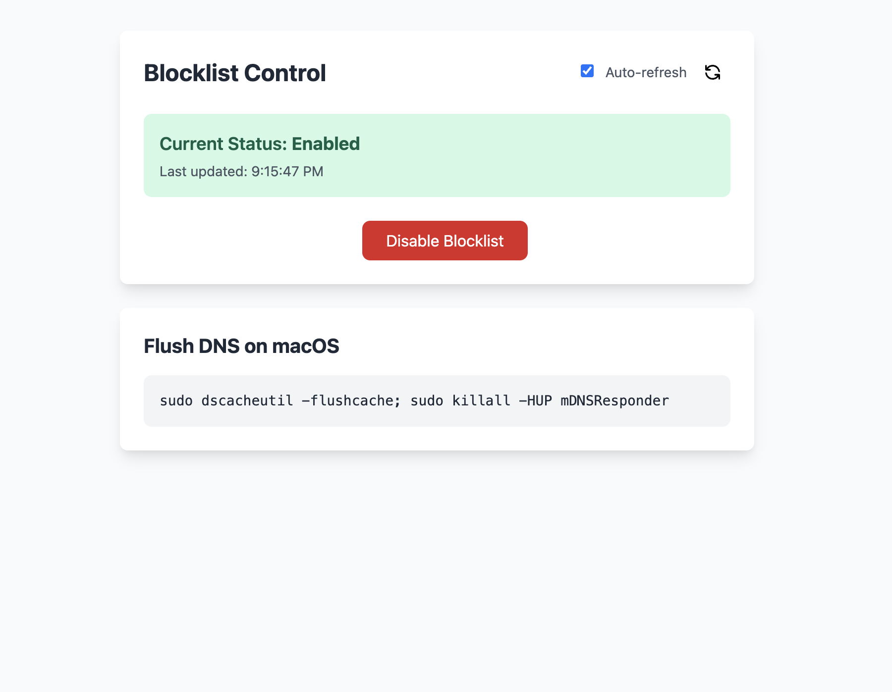

# opnsense_quick_manager



Simple web interface to toggle and monitor OPNsense DNS blocking.

## Setup

```bash
docker run --rm -p 8000:8000 \
    -e "OPNSENSE_HOST=$OPNSENSE_HOST" \
    -e "OPNSENSE_API_KEY=$OPNSENSE_API_KEY" \
    -e "OPNSENSE_API_SECRET=$OPNSENSE_API_SECRET" \
    ghcr.io/jasonraimondi/opnsense_quick_manager
```

Web UI at http://localhost:8000
